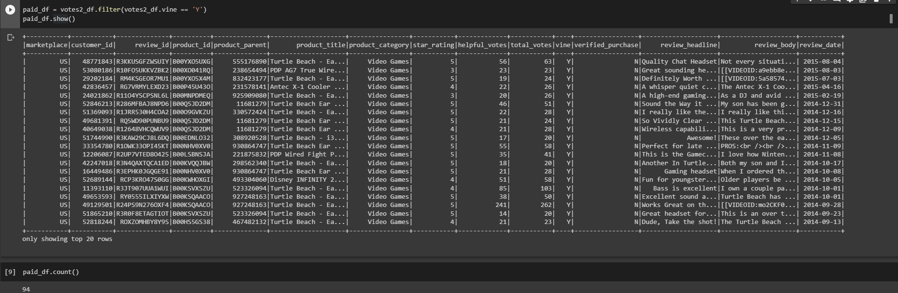
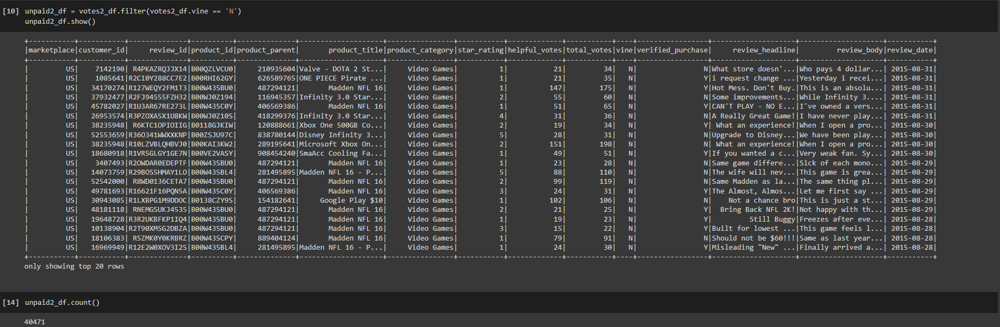
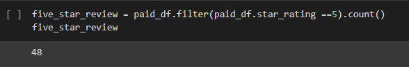
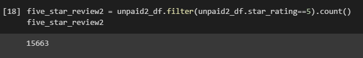
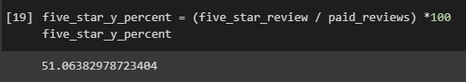
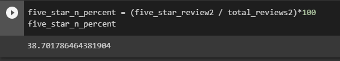

# Overview
In this project we are tasked with analyzing Amazon products and the reviews that they have received from the Amazon memebers paid Vines program. We will have to transfer raw data from Amazon's RDS system into pgAdmin where we will create DataFrame tables. After we create the tables in pgAdmin they will be exported into PySpark were we will further clean up our data in order to get how many reviews were by paid subscribers and how many were from unpaid subscribers. 

# Results

How many Vine reviews and non-Vine reviews were there?

We had a total of 94 Vines reviews

A total of 40471 on non-vine reviws 

 

How many Vine reviews were 5 stars? How many non-Vine reviews were 5 stars?

A total of 48 reviews were conducted by the Vines members

Non Vine had 15,663 reviews 

What percentage of Vine reviews were 5 stars? What percentage of non-Vine reviews were 5 stars?

We can see that 51% of the paid reviews were done the Vine members

Only 38% of the 5 star reviews came from the Non Vine members. 

# Summary 

If we were only to look at the percentage we would see that paid Vine members had 51% of the reviews and non vine memebrs had 39%. But the reality is non vine members did 40.716 reviews and paid vine memebrs only did 94. SO its very clear that the percentage of 5 star reviews is higher for the Vine members as the the amount of data was much lower. 

We could have compared out data based on the sales, reviews and time that the product was owned. Its very easy lo leave a review based on just looking at the item but if we gave an option of testing the items for some time then leaveing the review would be much better.   

